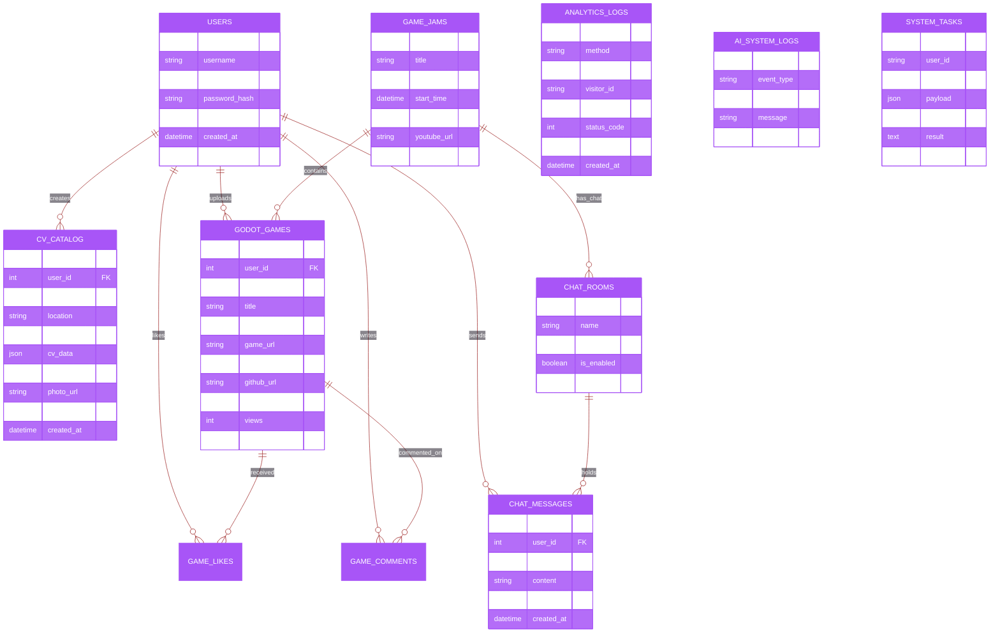
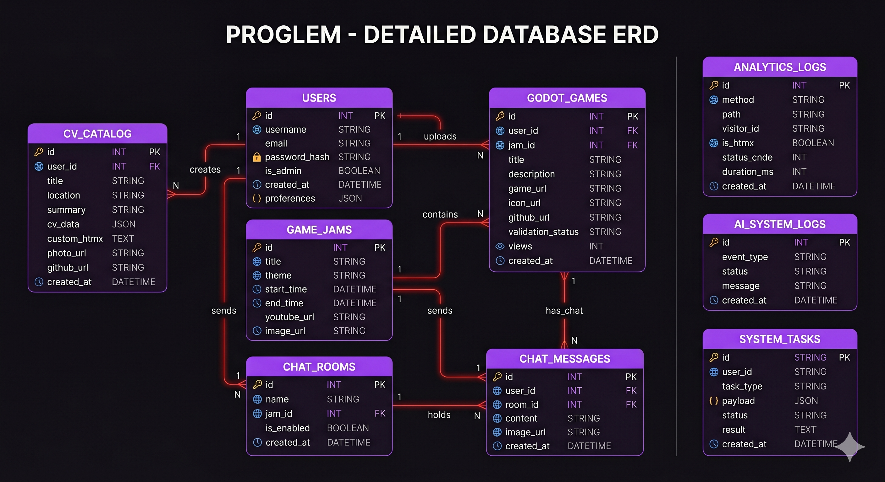

# Proglem - Database Architecture

This document outlines the relational structure of the Proglem platform database.

## Entity Relationship Diagram (ERD)

## Visual Representations

### 1. Detailed Entity Relationship Diagram
This is a high-fidelity rendering of the actual database schema, following the project's **60-30-10** design system.

*   **60% (Base)**: Deep Blackcurrant (`#09060d`) - Background
*   **30% (Primary)**: Vibrant Purple (`#a855f7`) - Table Headers & Accents
*   **10% (Contrast)**: Crimson Red (`#991b1b`) - Relationship Connectors

### 2. Conceptual Architecture
A high-level visualization of the platform's module interconnectedness.

> [!NOTE]
> The Mermaid ERD at the top of this document is the live-synced reference for development. The images above provide a professional visual overview for documentation and presentation purposes.
